# Data Flow — NASA-SSH Products

**Scope:** the **reference-mission** and **high latitude** along-track products and the downstream products that take them as input.

The along-track stages (`daily_files` → `xover` → `oer` → `xover` → `bad_pass` →
`finalizer`) are generic — *every* source runs its own independent instance of
them. Reference-mission sources continue into the **unifier**, which exists to 
assemble the reference-mission record; high-latitude sources never enter it.

```mermaid
flowchart TB
    subgraph UP["Reference-mission runs — PO.DAAC granules via CMR"]
        direction LR
        GSFC["<b>GSFC</b><br/>1992-10-25 → 2025-12-31"]
        S6["<b>S6</b><br/>2026-01-01 →"]
    end

    subgraph UA["High-latitude runs — AVISO granules via THREDDS, plus the reference mission"]
        direction TB
        S3B["<b>S3B</b><br/>2018-11-24 → 2026-04-10"]
        S3A["<b>S3A</b><br/>2018-11-24 → 2026-04-10"]
        SARAL["<b>Saral</b><br/>2018-11-24 → 2026-04-10"]
        CRYO["<b>Cryosat-2</b><br/>2018-11-24 → 2026-04-10"]
        ENVI["<b>Envisat</b><br/>2018-11-24 → 2026-04-10"]
        ERS1["<b>ERS-1</b><br/>2018-11-24 → 2026-04-10"]
        ERS2["<b>ERS-2</b><br/>2018-11-24 → 2026-04-10"]
        NSSHREF[/"NASA-SSH reference-mission along-track product<br/><i>required for crossovers</i>"/]

        GAP[" "]

        %% Invisible links only — layout scaffolding, no data flow implied.
        %% Under direction TB a rank is a row, so each chain below becomes one
        %% column. Two rules drive this:
        %%   1. Both chains must be the SAME length. dagre makes edges tight, so
        %%      a shorter right-hand chain gets pulled down to meet NSSHREF and
        %%      S3A stops lining up with S3B. GAP is a transparent node that
        %%      holds the empty fourth slot open and keeps the chains even.
        %%   2. NSSHREF needs a link from BOTH column tails — dagre centers a
        %%      node between its predecessors, so one link would pin it under a
        %%      single column.
        %%
        %%   S3B    S3A
        %%   SARAL  CRYO
        %%   ENVI   ERS2
        %%   ERS1   GAP (invisible)
        %%      NSSHREF

        S3B ~~~ SARAL
        SARAL ~~~ ENVI
        ENVI ~~~ ERS1

        S3A ~~~ CRYO
        CRYO ~~~ ERS2
        ERS2 ~~~ GAP

        ERS1 ~~~ NSSHREF
        GAP ~~~ NSSHREF
    end

    UP --> AT
    UA --> AT

    subgraph AT["Along-track product pipeline — one independent run per source"]
        direction TB

        DF["<i>daily file generation</i><br/>MSS swapped, ssha smoothed, nasa_ssh flag derivation"]
        DF ==> P1[/"P1 — daily along track file"/]
        P1 ==> OER["<i>oer</i><br/>apply correction"]
        OER ==> P2[/"P2 — OER-corrected daily along track file"/]
        P2 ==> FIN["<i>finalizer</i><br/>apply absolute offset, flag bad passes"]
        FIN ==> P3[/"P3 — finalized daily file"/]

        P1 --> X1["<i>xover</i>"]
        X1 --> XO1[/"p1 crossovers"/]
        XO1 -->|"stats fit the correction"| OER

        P2 --> X2["<i>xover</i>"]
        X2 --> XO2[/"p2 crossovers"/]
        XO2 --> BP["<i>bad pass flagging</i><br/>stats vs. thresholds"]
        BP -->|"which passes to flag"| FIN
    end

    subgraph HILAT["High-latitude product lines; not yet in production"]
        direction TB
        HLP[/"NASA-SSH high-latitude along-track product"/]
    end

    subgraph REF["Reference-mission product line"]
        direction TB
        UNIF["<i>unifier</i><br/>reference-mission product selection"]
        UNIF ==> NSSH[/"NASA-SSH reference-mission along-track product"/]
    end

    P3 -.->|"high-latitude sources"| HLP
    P3 -->|"reference-mission sources"| UNIF

    NSSH --> SGS

    subgraph SG["Gridded product pipeline"]
        direction TB

        SGS["simple grids<br/>basin-aware Gaussian resample to 0.5°"]
        SGS ==> SGP[/"NASA-SSH reference-mission simple grid product"/]

        SGP --> ENSO["enso grids<br/>smooth, deseason, detrend, → 0.25°"]
        ENSO ==> EM[/"ENSO maps<br/>ortho + plate PNGs for websites"/]

        SGP --> IND["indicators<br/>GMSL, ENSO, PDO, IOD"]
        IND ==> INDP[/"NASA-SSH indicators products"/]
    end

    classDef upstream fill:#fdeae1,stroke:#eb6834,stroke-width:1.5px,color:#0b0b0b
    classDef stage fill:#cde2fb,stroke:#2a78d6,stroke-width:1.5px,color:#0b0b0b
    classDef internal fill:#f0efec,stroke:#8a8985,stroke-width:1px,color:#0b0b0b
    classDef published fill:#d7f2e7,stroke:#1baf7a,stroke-width:2px,color:#0b0b0b
    classDef disabled fill:#e6e4e1,stroke:#a6a09a,stroke-width:1.5px,stroke-dasharray:5 3,color:#615c57
    classDef hidden fill:none,stroke:none,color:transparent

    class GAP hidden

    class GSFC,S6,S3B upstream
    class DF,OER,FIN,X1,X2,BP,UNIF,SGS,ENSO,IND stage
    class P1,P2,XO1,XO2,P3 internal
    class NSSH,NSSHREF,SGP,EM,INDP published

    %% Not enabled yet — greyed so the live path reads at a glance.
    class S3A,SARAL,CRYO,ENVI,ERS1,ERS2,HLP disabled
```

**Reading the diagram.** Blue = a processing stage; gray = an intermediate file;
green = a published product; orange = upstream granules. Rectangles are stages,
parallelograms are files; the boxes are grouping only.

Anything **greyed out with a dashed border is not enabled yet**, and the dashed
edge into it marks the branch that is not live. S3B is the only high-latitude
source running today, so its product line is drawn but inactive.

**Required inputs** is grouped by which family of run consumes them, which is why
one input is green: a high-latitude run needs the pipeline's own reference-mission
product, already published, to compute its crossovers against — it has no
same-mission passes of its own to cross (see
[ADR-0006](adr/0006-reference-crossovers-against-nasa-ssh-p3.md)). That product
therefore appears twice: as an input at the top, as an output below.

In the along-track pipeline, the bold chain is the daily file as each stage
rewrites it. The side branches compute the statistics that drive those rewrites —
crossover stats set the OER correction, bad-pass stats decide which passes get
flagged.

## What the diagram leaves out

- **Cross-date windows.** OER and bad-pass flagging each read a window of crossover
  files spanning several dates, not only the date being processed.
- **Write-only artifacts.** OER's fitted polygons and corrections are saved for
  diagnostics; no stage reads them back.
- **S6B**, a configured reference source that reaches P3 without contributing to
  the reference-mission record.

The upstream collections each source reads are declared in
`utilities/sources/{source}.yaml`. Stage configuration and the Step Functions
hierarchy are documented in the [README](../README.md); each stage's directory has
its own README, and S3 key conventions live in
[`utilities/pipeline_layout.py`](../utilities/pipeline_layout.py).
