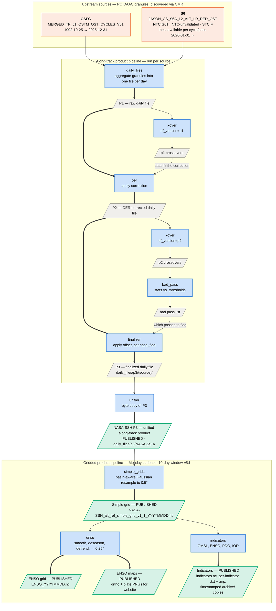

# Data Flow

High-level view of what the pipeline ingests and what it publishes.
Terminology follows [CONTEXT.md](../.claude/CONTEXT.md); S3 key conventions are
owned by [`utilities/pipeline_layout.py`](../utilities/pipeline_layout.py) and
filename templates by [`utilities/products.yaml`](../utilities/products.yaml).

This is the high-level view; for the exact key written by any given stage, read
`pipeline_layout.py` directly.

**Reading the diagram.** Blue = a processing stage (a Lambda); gray = an
intermediate artifact; green = a published product; orange = upstream input.
Rectangles are stages, parallelograms are files — so role is carried by shape and
label as well as color.

Within the along-track pipeline, the thick spine is the daily file's own
lifecycle, P1 → P2 → P3 — each stage on it rewrites the file. The thin branches
hanging off it derive *statistics* from a daily file and feed them back into the
next spine stage: crossovers fit the OER correction, and bad-pass thresholds
decide which passes the finalizer flags. Nothing on a branch is a dead end, and
nothing on the spine is skipped.

## Notes

### One code path, run per source

GSFC and S6 are both `product_type: reference`, so both take the same
along-track sequence and the same `alt_ref_at_*` filename family, and both use
self-crossovers (`crossover_type: self` — a pass crossed against the source's own
passes over a forward window).

S6 lists three upstream collections with a `priority`. That resolution happens
per `(cycle, pass)`, not per collection: for each pass the lowest priority number
available wins, so a day can draw NTC for some passes and STC for others.

### Why crossovers are computed twice

The `xover` stage is a single stage invoked as two steps, against two different
daily-file versions. The p1 pass supplies the statistics that *fit* the OER
correction; the p2 pass re-derives them from the now-corrected file, so bad-pass
flagging thresholds a pass on its residual error after OER rather than before.

### Unification is a byte copy, not a merge

Both production sources have `unify: true`, so the unifier `copy_object`s their
P3s under the `NASA-SSH` prefix. Their coverage is non-overlapping in time (GSFC
ends 2025-12-31, S6 starts 2026-01-01), so the unified product is a temporal
concatenation rather than a blend. The in-file `processing_history` lineage
survives the copy. `unify` is a per-source flag, so a source can be processed to
P3 without contributing to NASA-SSH.

### What is published

1. **NASA-SSH P3 along-track** — the unified product
2. **Simple grids** — 0.5°, 10-day window centered on each Monday
3. **ENSO** — 0.25° grid plus orthographic and plate-carrée PNG maps for the website
4. **Indicators** — `indicators.nc`, per-indicator `.txt` and `.mp` files, and
   timestamped `archive/` copies

Everything else is pipeline-internal, including the **per-source P3 daily files**:
they are the input the unifier copies from, not a deliverable in their own right.
Crossovers and the bad-pass list are likewise internal. OER additionally writes its
fitted polygons and per-point corrections to `oer/{source}/{year}/`; these are
write-only diagnostics — no other stage reads them back — so they are omitted from
the diagram.

### Cross-date dependencies the diagram flattens

Crossovers are not single-date dead ends. OER fits over a window of crossover
files across dates, and bad_pass reads a window of p2 crossovers, so both consume
neighboring dates' outputs rather than just the same date's. Window widths are
per-source (`xover.window_size`, `window_padding`).

## Not yet in production

Two configured sources are deliberately omitted from the diagram above. Add them
back here when they go live:

- **S6B** (`utilities/sources/S6B.yaml`) — another `reference` source, same code
  path as S6, with `unify: false`.
- **S3B** (`utilities/sources/S3B.yaml`) — the first `high_latitude` source,
  ingested from AVISO–ODATIS over THREDDS rather than PO.DAAC. It introduces the
  `alt_hilat_at_*` filename family and the pipeline's only feedback edge: its
  crossovers are computed against the finalized NASA-SSH P3 product
  (`crossover_type: reference`, see
  [ADR-0006](adr/0006-reference-crossovers-against-nasa-ssh-p3.md)), so a
  published product re-enters as an input.
