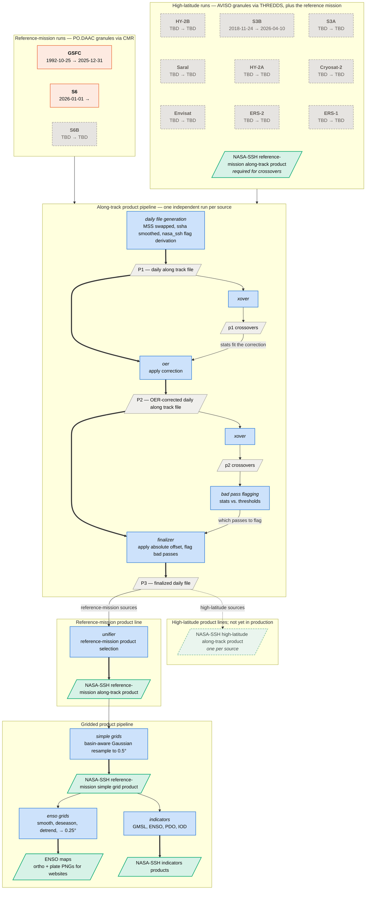

# Data Flow — NASA-SSH Products

**Scope:** the **reference-mission** and **high latitude** along-track products and the downstream products that take them as input.

The along-track stages (`daily_files` → `xover` → `oer` → `xover` → `bad_pass` →
`finalizer`) are generic — *every* source runs its own independent instance of
them. Reference-mission sources continue into the **unifier**, which exists to 
assemble the reference-mission record; high-latitude sources never enter it. So the
two families end differently: many reference-mission sources collapse into one
stitched product, while each high-latitude satellite publishes its own.

**Reading the diagram.** Blue = a processing stage; gray = an intermediate file;
green = a published product; orange = upstream granules. Rectangles are stages,
parallelograms are files; the boxes are grouping only.

A **dashed border means not enabled yet**, and a dashed edge marks a branch that
is not live. Color still carries the role, so the inactive high-latitude product
stays green — faded, but a product rather than an intermediate file. GSFC and S6
are the only sources enabled today, which is why the entire high-latitude branch
is dashed.

**Required inputs** is grouped by which family of run consumes them, which is why
one input is green: a high-latitude run needs the pipeline's own reference-mission
product, already published, to compute its crossovers against — it has no
same-mission passes of its own to cross (see
[ADR-0006](adr/0006-reference-crossovers-against-nasa-ssh-p3.md)). That product
therefore appears twice: as an input at the top, as an output below.

In the along-track pipeline, the bold chain is the daily file as each stage
rewrites it. The side branches compute the statistics that drive those rewrites —
crossover stats set the OER correction, bad-pass stats decide which passes get
flagged.
